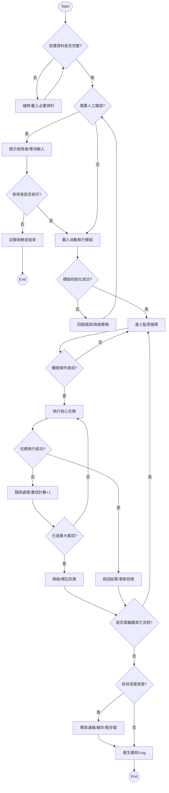

# DDS 自動模式流程 (AutoModeFlow)

## 1. 流程設計目標
- **穩定性**：確保各模組間狀態切換時具備明確條件與回退策略。
- **可觀測性**：每個節點具備事件/Log 產出，方便追蹤。
- **可回復性**：錯誤節點明確返回點或終止條件。
- **模組化**：拆分為資料擷取、判斷決策、任務執行、結束處理四大區塊。

## 2. 主要流程階段總覽
| 區塊 | 說明 | 代表顏色 |
|------|------|----------|
| 啟動/初始化 | 環境、參數、連線與快取檢查 | 白色/起始節點 |
| 手動/條件判斷 | 使用者輸入或系統條件評估 | 黃色節點 |
| 自動執行行為 | 系統策略自動化動作 | 綠色節點 |
| 例外/終止 | 流程結束或異常回收 | 圓形 End |

> 黃色：判斷 / 使用者介入
> 綠色：系統自動執行 / 作業階段

## 3. 節點語意定義
| 節點名稱 | 類型 | 說明 | 觸發條件 | 輸出 / 下一步 |
|----------|------|------|-----------|----------------|
| Start | 起點 | 流程啟動 | 系統調度 / 手動觸發 | 進入前置檢查 |
| 資料有效? | 判斷 | 檢查必要初始資料 | 缺資料 / 有資料 | 補齊資料 or 進行下一步 |
| 手動任務切換 | 動作 | 人工作業/系統授權 | 使用者確認 | 進入對應功能模組 |
| 模組載入 | 動作 | 初始化對應策略模組 | 模組存在 | 載入成功/失敗回退 |
| 狀態監測 | 自動 | 監聽外部訊號/條件變化 | 排程/事件 | 續行 or 觸發分支 |
| 回寫更新 | 自動 | 寫回結果/中繼狀態 | 任務完成 | 進下一節點 |
| 中止條件? | 判斷 | 檢測是否需提前結束 | 取消/錯誤/Timeout | 結束 or 回復/重試 |
| End | 結束 | 流程終點 | 任務完成/中止 | - |

(可依您後續提供的中文節點實際名稱再行對照微調)

## 4. Mermaid 原理圖 (高階)
> 註：此為根據提供圖片推導之結構化抽象版，實際節點名稱請再對照最終圖。

## 5. 詳細階段說明
### 5.1 啟動與驗證
1. 收到觸發 (排程 / API / 人工) → 建立執行上下文 (TraceId, 時戳, 呼叫來源)。
2. 驗證必要輸入（參數、使用者權限、環境變數、快取配置）。
3. 初始化資源：
   - DB / Key-Value 連線池檢查
   - 外部服務健康檢查 (Timeout, Retry Policy)
   - 記憶體內部暫存結構預熱

### 5.2 條件與人工分支
1. 判斷流程模式：自動 或 半自動。
2. 若需人工核可：推送事件或通知 (Webhook / UI Prompt / Telegram Bot)。
3. 等待回應（含 Timeout 策略 + 重試 / 轉為自動策略）。

### 5.3 模組載入與策略選擇
1. 依輸入或狀態選擇對應策略模組 (Ex: 掃描、比對、路線計算、派送)。
2. 動態載入 Plugin / DI 容器解析具體實作。
3. 版本與相容性檢查，若失敗：降級或回退預設模組。

### 5.4 監測循環 (事件驅動)
| 項目 | 說明 | 週期/觸發 |
|------|------|-----------|
| 狀態輪詢 | 訂閱外部訊號或 DB 狀態 | Interval / Webhook |
| Timeout Guard | 任務長時間無回應中斷 | Deadline 驗證 |
| 動態調整 | 根據回饋切換策略 | 閾值觸發 |

### 5.5 核心任務執行
- 前置：鎖資源 / 校驗併發 / 建立工作執行紀錄。
- 主流程：具體業務邏輯（依模組不同）。
- 中間：可插入 Hook（前/後）→ 埋點統計。
- 結果：成功 / 可重試錯誤 / 致命錯誤分類。

重試策略：
| 類別 | 是否重試 | Policy |
|------|-----------|--------|
| 網路暫失 | 是 | Exponential Backoff + Jitter |
| 第三方 4xx | 否 | 即時失敗並記錄 |
| 第三方 5xx | 是 | 限次 (如最多 3 次) |
| 邏輯驗證失敗 | 否 | 回報資料問題 |

### 5.6 結果寫回與後處理
1. 寫回主資料表 & 事件快照。
2. 發送後續通知 (Message Queue / Webhook / 內部事件匯流排)。
3. 更新快取與指標 (Prometheus / 時序 DB)。
4. 狀態標記完成、產生審計記錄。

### 5.7 終止與清理
- 條件：完成 / 人工中止 / Timeout / 致命錯誤。
- 動作：釋放連線、刪除暫存檔、清除記憶體快取、關閉背景 Task。
- 最終：歸檔 Log、計算耗時、回傳標準結構 Response。

## 6. 事件與 Log 規格 (建議)
| 階段 | 事件代碼 | 等級 | 資料欄位 | 描述 |
|------|----------|------|----------|------|
| 啟動 | FLOW_START | Info | traceId, mode, caller | 流程啟動 |
| 驗證 | VALIDATION_FAIL | Warn | reason, field | 輸入驗證失敗 |
| 授權 | HUMAN_PENDING | Info | userId, expireAt | 等待人工回應 |
| 授權 | HUMAN_TIMEOUT | Warn | userId, timeoutSec | 人工逾時轉自動 |
| 載入 | MODULE_LOAD_ERR | Error | module, version, reason | 模組載入失敗 |
| 監測 | WATCH_HEARTBEAT | Debug | tick, pendingTasks | 週期性心跳 |
| 任務 | TASK_BEGIN | Info | taskId, type | 任務開始 |
| 任務 | TASK_RETRY | Warn | taskId, retryCount, reason | 任務重試 |
| 任務 | TASK_FAIL | Error | taskId, reason, fatal | 任務失敗 |
| 任務 | TASK_SUCCESS | Info | taskId, durationMs | 任務成功 |
| 結束 | FLOW_END | Info | traceId, status, durationMs | 流程結束 |

## 7. 錯誤分類與處理策略
| 分類 | 例子 | 處理 | 上報 |
|------|------|------|------|
| 可重試暫時性 | 網路閃斷、第三方 503 | Backoff 重試 | Warn + 計數 |
| 不可重試業務錯誤 | 輸入缺欄、狀態非法 | 結束流程 | Warn |
| 致命系統錯誤 | OOM、資料庫連線池崩潰 | 立即中止並告警 | Error + Alert |
| 人工拒絕 | 使用者取消 | 標記取消 | Info |
| Timeout | 長時間無心跳 | 中止/補償 | Error |

## 8. 安全與權限考量
- 所有人工互動節點需驗證使用者身份與操作授權。
- 模組載入需校驗來源與雜湊 (防止惡意替換)。
- 審計 Log 不得紀錄敏感純文字 (Token 脫敏)。

## 9. 延展性建議
| 面向 | 建議 |
|------|------|
| 負載 | 任務排程採用佇列分流 (優先 / 一般)。|
| 模組 | 採用策略/工廠模式動態註冊。|
| 觀測 | 介面暴露 Metrics (成功率、P95 延遲、Retry 次數)。|
| 擴充 | 支援多執行個體 Lock (分散式鎖)。|

## 10. 後續可補強
- 對應每個實際綠色節點 → 提供更細的輸入/輸出欄位表格。
- 增加時序圖 (Sequence Diagram) 針對核心任務。
- 增加失敗補償流程 (Compensation Saga)。

---
若您提供實際各綠/黃節點中文原文，我可以再依名稱精準對應並產出最終正式版。
