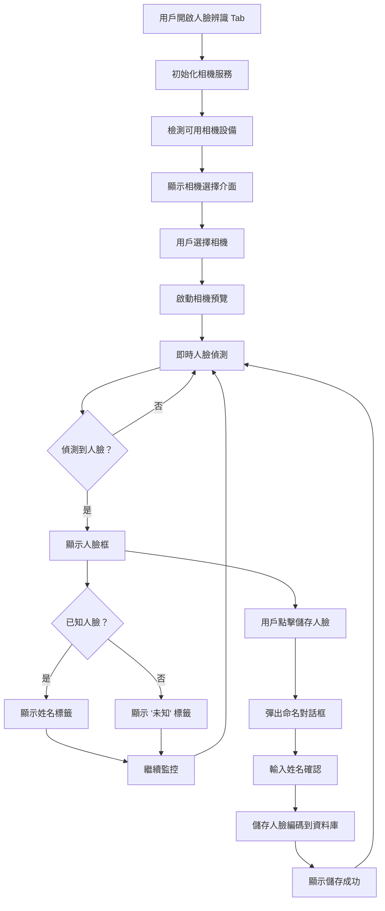
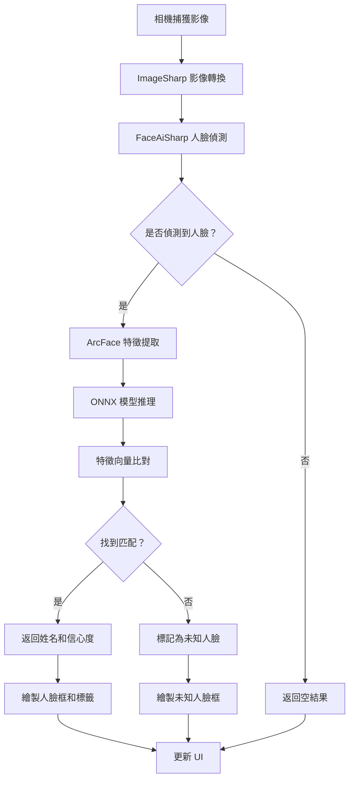
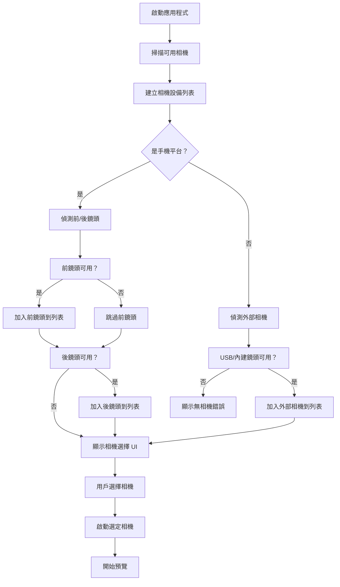
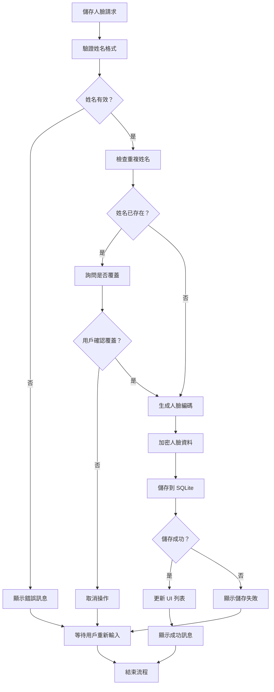
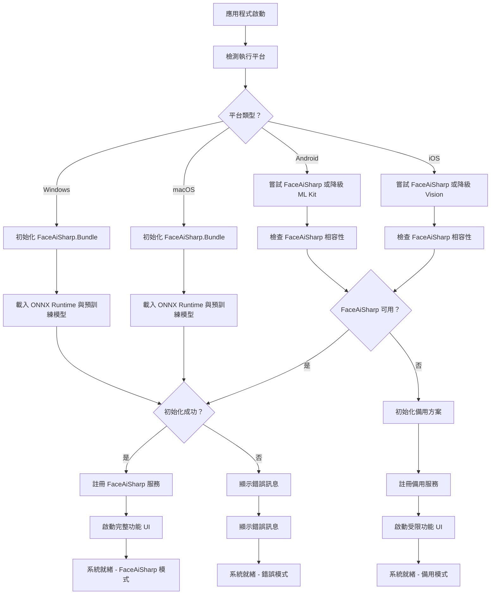
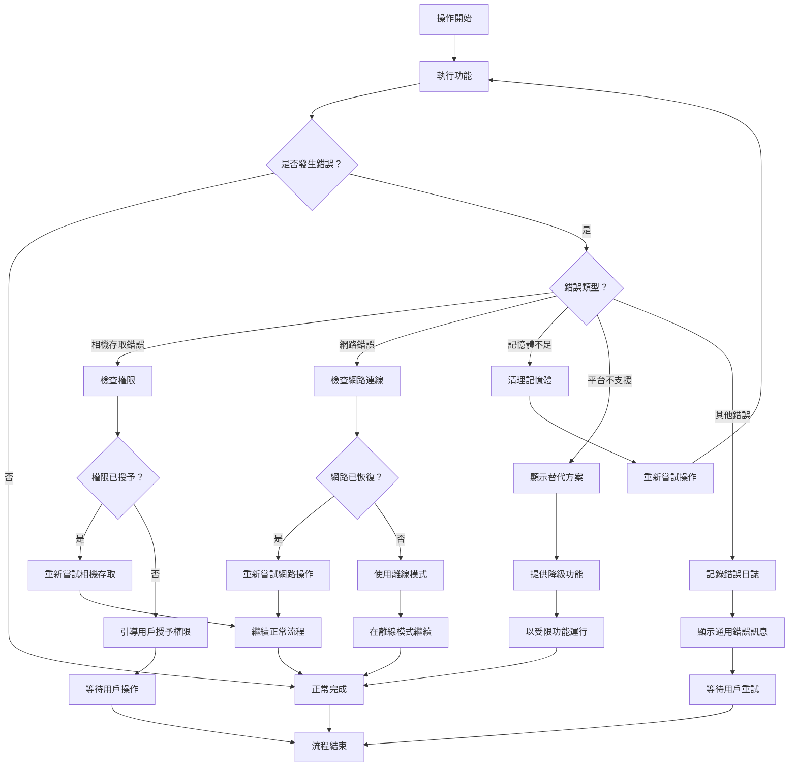
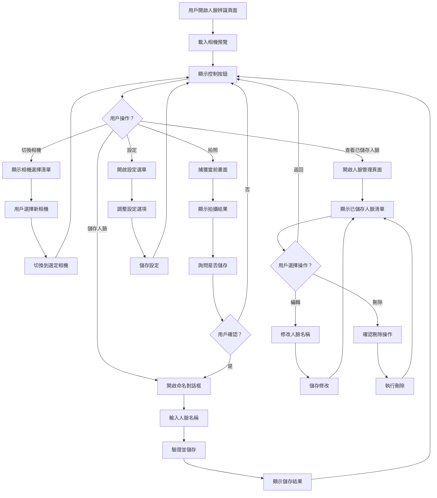
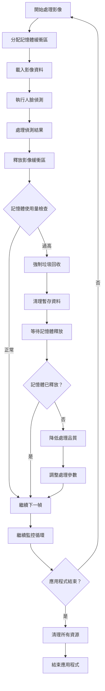
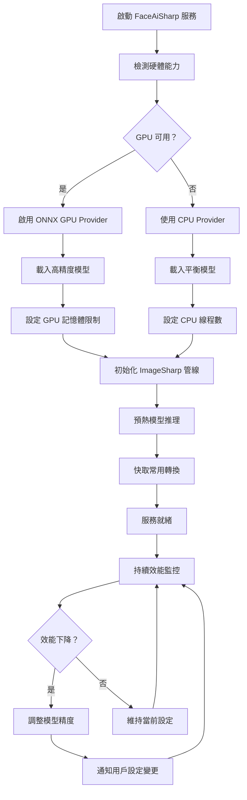

# FaceAiSharp 人臉辨識系統流程圖

## 1. 整體系統架構流程圖

## 2. FaceAiSharp 人臉處理流程

## 3. 相機設備管理流程

## 4. 資料儲存與管理流程

## 5. FaceAiSharp 服務初始化流程

## 6. 錯誤處理流程

## 7. 用戶互動流程

## 8. 記憶體管理流程

## 系統流程說明

### 核心流程特點：

1. **非同步處理**: 所有相機操作和人臉辨識處理都在背景執行緒進行
2. **錯誤恢復**: 每個主要操作都有對應的錯誤處理機制
3. **記憶體優化**: 實時監控記憶體使用，適時釋放資源
4. **平台適應**: 根據不同平台選擇最佳的技術實作
5. **用戶體驗**: 提供即時反饋和直覺的操作介面

### FaceAiSharp 關鍵決策點：

- **技術統一**: FaceAiSharp 提供統一的 API，簡化跨功能開發
- **ONNX 優化**: 利用 ONNX Runtime 實現最佳硬體加速
- **模型管理**: Bundle 套件簡化模型部署與版本控制
- **平台適配**: 優先桌面平台，移動平台採用備用策略
- **效能分層**: 根據平台能力選擇不同精度的模型配置

## 9. FaceAiSharp 特有優化流程

這個 FaceAiSharp 為中心的流程圖架構展現了現代化人臉辨識系統的完整生命週期，從初始化到動態優化，確保在不同平台上都能提供最佳的用戶體驗和技術效能。